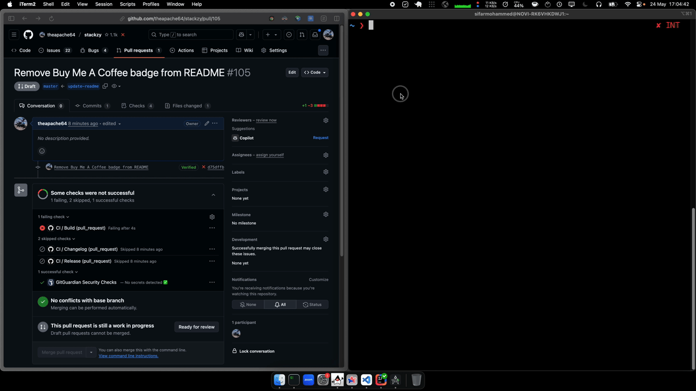

# pr-filler


<a href="https://twitter.com/theapache64" target="_blank">

</a>

> A tool that automatically fills out GitHub pull request descriptions using AI by analyzing code diffs.

### ✨ Demo



## Installation

```bash
sudo npm install -g pr-filler
```

## Prerequisites

Set the following environment variables:

```bash
export GITHUB_ACCESS_TOKEN="your_github_token"
export OPEN_AI_API_KEY="your_openai_api_key"
```

## Usage

```bash
# Interactive mode
pr-filler

# With PR URL as argument
pr-filler https://github.com/owner/repo/pull/123

# With AI model specification
pr-filler --url https://github.com/owner/repo/pull/123 --model gpt-4o

# Using short flags
pr-filler -u https://github.com/owner/repo/pull/123 -m gpt-3.5-turbo
```

## Command-line flags

- `--url, -u`: Specify the GitHub pull request URL
- `--model, -m`: Specify the OpenAI model to use (default: gpt-4.1)

## How it works

1. Fetches the existing PR template and code diff from GitHub
2. Sends both to the specified OpenAI model (default: gpt-4.1) to generate a detailed description
3. Updates the PR body on GitHub with the AI-generated content


## ✍️ Author

👤 **theapache64**

* Twitter: <a href="https://twitter.com/theapache64" target="_blank">@theapache64</a>
* Email: theapache64@gmail.com

Feel free to ping me 😉

## 🤝 Contributing

Contributions are what make the open source community such an amazing place to learn, inspire, and create. Any
contributions you make are **greatly appreciated**.

1. Open an issue first to discuss what you would like to change.
1. Fork the Project
1. Create your feature branch (`git checkout -b feature/amazing-feature`)
1. Commit your changes (`git commit -m 'Add some amazing feature'`)
1. Push to the branch (`git push origin feature/amazing-feature`)
1. Open a pull request

Please make sure to update tests as appropriate.

## ❤ Show your support

Give a ⭐️ if this project helped you!

<a href="https://www.patreon.com/theapache64">
  
</a>

<a href="https://www.buymeacoffee.com/theapache64" target="_blank">
    
</a>


## 📝 License

```
Copyright © 2025 - theapache64

Licensed under the Apache License, Version 2.0 (the "License");
you may not use this file except in compliance with the License.
You may obtain a copy of the License at

   http://www.apache.org/licenses/LICENSE-2.0

Unless required by applicable law or agreed to in writing, software
distributed under the License is distributed on an "AS IS" BASIS,
WITHOUT WARRANTIES OR CONDITIONS OF ANY KIND, either express or implied.
See the License for the specific language governing permissions and
limitations under the License.
```

_This README was generated by [readgen](https://github.com/theapache64/readgen)_ ❤
